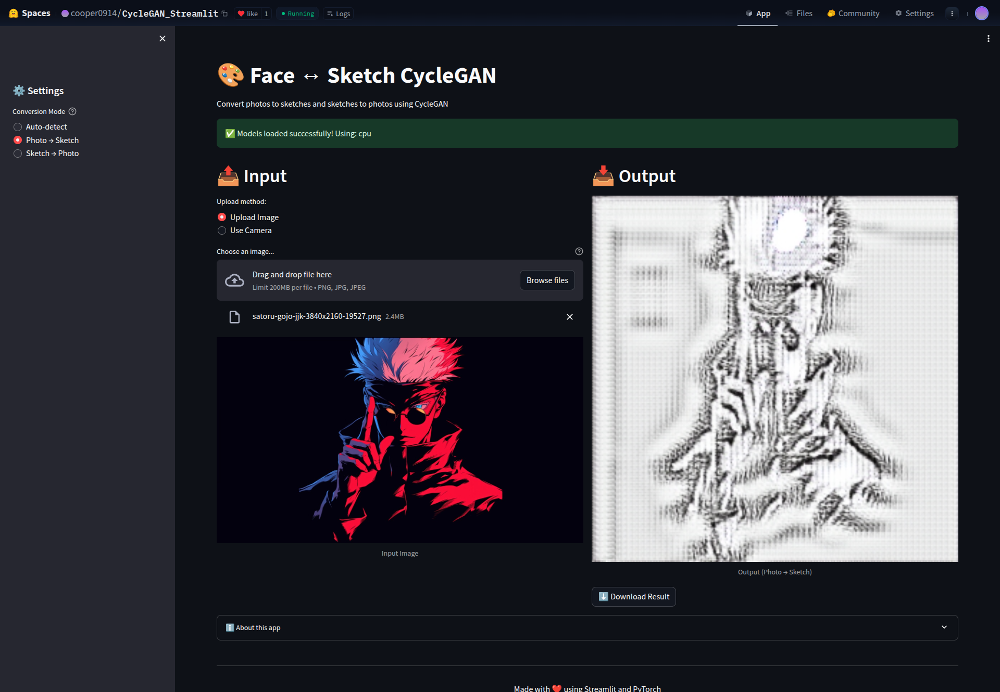
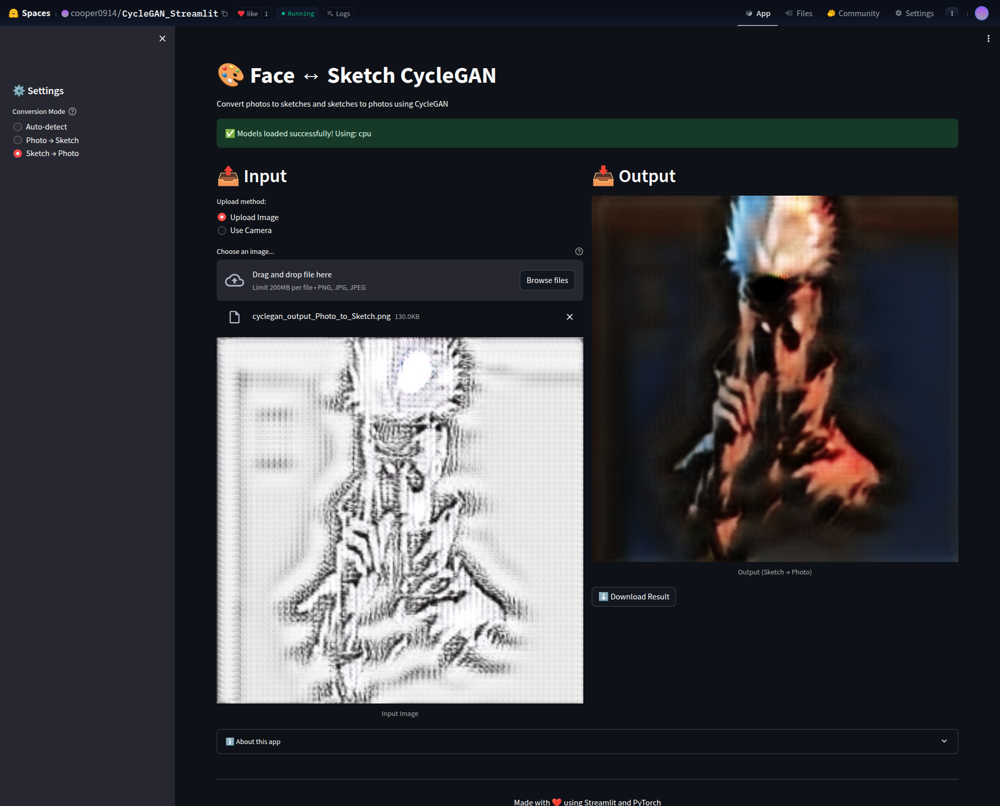

# 🎨 CycleGAN Face-Sketch Converter

Convert face photos to sketches and vice versa using CycleGAN deep learning.

## 🌐 Live Demo

[](https://huggingface.co/spaces/cooper0914/CycleGAN_Streamlit)


---

*Photo ↔ Sketch conversion in action*

## ✨ Features

- **Bidirectional Conversion**: Photo → Sketch and Sketch → Photo
- **Auto-Detection**: Automatically identifies input type
- **Camera Support**: Take photos directly in the app
- **Instant Download**: Save your converted images
- **Responsive UI**: Works on desktop and mobile
- **Fast Inference**: 3-5 seconds on CPU, <1 second on GPU

## 🚀 Quick Start

### Local Installation

```bash
# Clone the repository
git clone https://github.com/yourusername/cyclegan-face-sketch.git
cd cyclegan-face-sketch

# Install dependencies
pip install -r requirements.txt

# Run the app
streamlit run app.py
```

Open your browser to `http://localhost:8501`

### Usage Tips

- Use clear, front-facing photos for best results
- Ensure good lighting in your images
- Images are automatically resized to 256×256 pixels

## 🧠 Model Details

- **Architecture**: CycleGAN with ResNet-based generators
- **Input Size**: 256×256 RGB images
- **Training Dataset**: Unpaired face-sketch pairs
- **Model Size**: ~44 MB per direction (~88 MB total)
- **Loss Functions**: 
  - Adversarial loss (LSGAN)
  - Cycle consistency loss
  - Identity loss

### Performance

| Hardware | Inference Time |
|----------|---------------|
| CPU Basic | ~3-5 seconds |
| GPU T4 | ~0.5 seconds |

## 🚢 Deployment (Optional)

### Deploy to Hugging Face Spaces

**Step 1: Export Your Models**

After training, run in your notebook:

```python
export_for_huggingface(checkpoint_epoch=100)  # Use your best epoch
```

This creates `photo_to_sketch.pth` and `sketch_to_photo.pth` in `deployment_models/`.

**Step 2: Create a Space**

1. Go to [Hugging Face Spaces](https://huggingface.co/spaces)
2. Click **"Create new Space"**
3. Choose **Streamlit** SDK
4. Select hardware (CPU Basic is free)

**Step 3: Upload Files**

```
your-space/
├── app.py
├── requirements.txt
├── photo_to_sketch.pth
├── sketch_to_photo.pth
└── README.md
```

Your Space will automatically build and deploy!

## 🙏 Acknowledgments

- **CycleGAN Paper**: Zhu, J.-Y., Park, T., Isola, P., & Efros, A. A. (2017). [Unpaired Image-to-Image Translation using Cycle-Consistent Adversarial Networks](https://arxiv.org/abs/1703.10593)
- **Dataset**: [Person Face Sketches Dataset](https://www.kaggle.com/datasets/almightyj/person-face-sketches) on Kaggle

---

**Made with ❤️ using PyTorch and Streamlit**